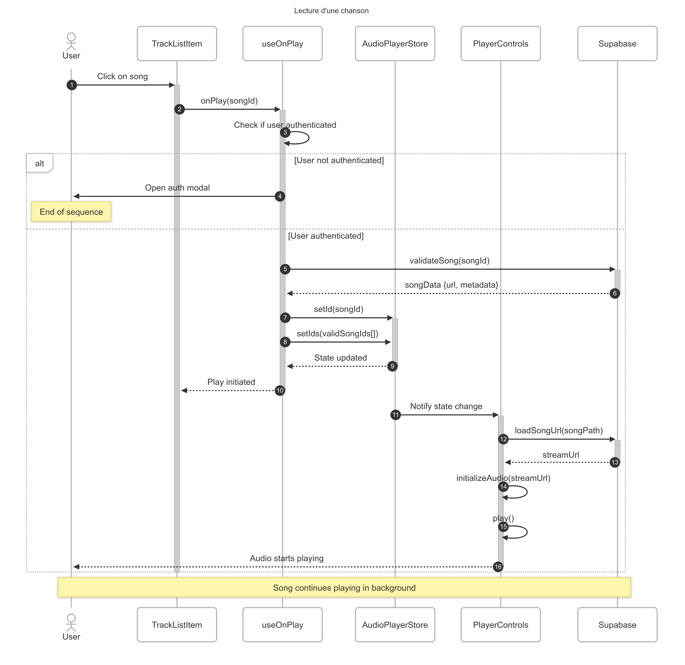
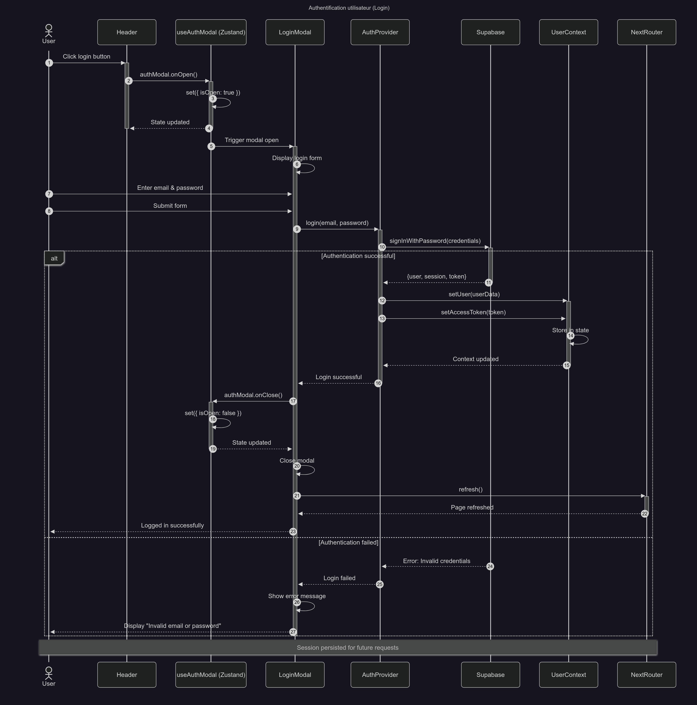

#  MyFlowAudio

Application de streaming audio développée avec next.js, typeScript et supabase. Ce projet permet aux utilisateurs d'écouter, de gérer et d'organiser leurs musiques préférées. 

##  Fonctionnalitées principales

-  **Lecteur audio** avec contrôles (play, pause, skip, volume)
-  **Recherche de music** via l'API Deezer et base de données locale
-  **Système de favoris** pour sauvegarder vos chansons préférées
- **Playlists personnalisées** pour organiser votre musique (pas fini)
-  **Authentification sécurisée** avec Supabase Auth
-  **Design responsive** optimisé pour mobile et desktop 
-  **Interface moderne** avec animations fluides grace à tailwind CSS

##  Technologies utilisées

### Frontend
- **Next.js 14** - Framework React avec App Router
- **TypeScript** - Typage statique pour une meilleure maintenabilité
- **Tailwind CSS** - Styles utilitaires et design system
- **Zustand** - Gestion d'état légère et performante
- **React Hot Toast** - Notifications élégantes

### Backend & Services
- **Supabase** - Backend as a Service (BaaS)
  - Authentication
  - PostgreSQL Database
  - Stockage pour les fichiers audio
- **Deezer API** - Catalogue musical externe

### Outils de développement
- **ESLint** - Linting du code
- **Zod** - Validation des schémas de données

##  Architecture du projet

1) actions/          # Server actions (next.js)
2) app/             # Routes et pages (App Router)
3) components/      # Composants React
3.1) features/    # Composants métier
3.2) ui/         # Composants UI réutilisables
4) hooks/          # Custom hooks React
5) lib/            # Utilitaires et validations
6) providers/          # Context providers

## Documentation architecture

### Diagrammes de classes

#### 1. Modèle du domaine métier

  

Ce diagramme présente les entités principale de l'application et leurs relations.

#### 2. Architecture des composants UI

  

Vue d'ensemble de la hiérarchie des composants React et leurs interactions.

### Diagrammes de séquence

#### 1. Lecture d'une chanson

  

Flux complet depuis le clic utilisateur jusqu'à la lecture audio.

#### 2. Authentification utilisateur

  

Etapes de connexion avec gestion des états et erreurs.

## Sécurité

- **Authentification** gérée par Supabase Auth
- **Validation des données** côté serveur avec Zod

## Patterns et bonnes pratiques

### Patterns utilisés

- **Provider Pattern** : Pour la gestion globale de l'état
- **Custom Hooks** : Réutilisation de la logique
- **Server Actions** : Pour les mutations de données
- **Composition** : Composants modulaires et réutilisables

